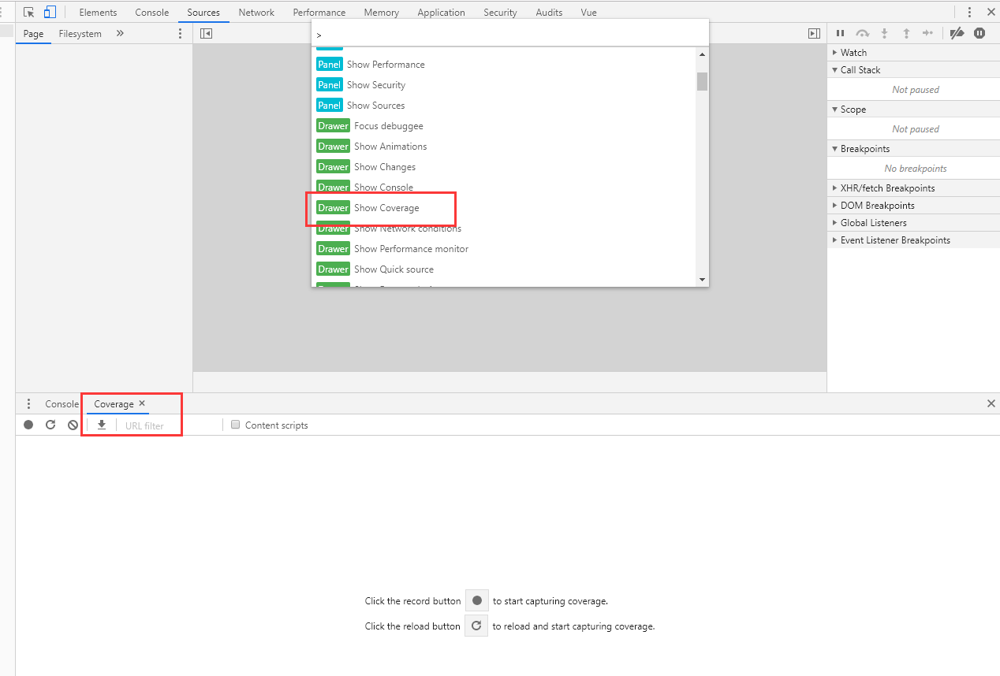
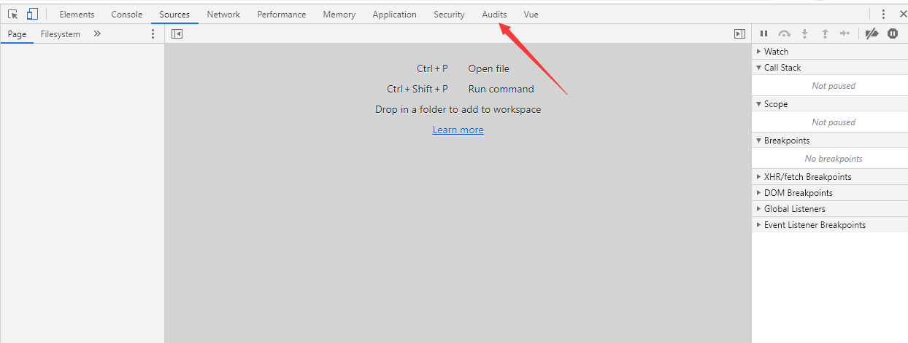

## 1.尽量使用缩写 ##
使用缩写语句，如下面所示的 margin 声明，可以从根本上减小 CSS 文件的大小。在 google 上搜索 CSS Shorthand 可以找到许多其他的速记形式。

    p { margin-top: 1px;
    margin-right: 2px;
    margin-bottom:  3px;
    margin-left: 4px; }

    p { margin: 1px 2px 3px 4px; }

## 2.查找并删除未使用的 CSS ##
删除不必要的部分 CSS，j显然会加快网页的加载速度。谷歌的Chrome浏览器有这种开箱即用的功能。只需F12然后打开Sources选项卡，然后打开命令菜单（Ctrl+shift+P）。然后，选择Show Coverage，在Coverage analysis窗口中高亮显示当前页面上未使用的代码。
打开谷歌浏览器开发都工具，在 Conlse 旁边更多选择 Coverage，就可以看到未使用的 CSS, 点击对应的项，高亮显示当前页面上未使用的代码。

## 3.分析工具 ##
谷歌浏览器的 Audits 就可以快速帮我们分析，使用方式，打开开发者工具，点击 Audits 栏位，点击 Run audits 后就开始分析结果。

> 对 CSS 的自动分析总是会导致错误。用压缩后的 CSS 文件替换 未压缩CSS文件之后，对整个网站进行彻底的测试——没有人知道优化器会导致什么错误。

## 4.内联关键 CSS ##
加载外部样式表需要花费时间，这是由于延迟造成的——因此，可以把最关键的代码位放在 head 中。但是，请确保不要做得过火，记住，执行维护任务的人员也必须读取代码。
    
    <html>
    <head>
	    
    </head>
    <body>
	    

	      Hello, world!
	    

	...

## 5.允许反并行解析 ##
@import 将 CSS 样式方便添加代码中。遗憾的是，这些好处并不是没有代价的：由于 @import 可以嵌套，因此无法并行解析它们。更并行的方法是使用一系列 <link> 标记，浏览器可以立即获取这些标记。
    
    @import url("a.css");
	@import url("b.css");
	@import url("c.css");
	
	<link rel="stylesheet" href="a.css">
	<link rel="stylesheet" href="b.css">
	<link rel="stylesheet" href="c.css">

## 6.用 CSS 替换图片 ##
几年前，一套半透明的 png 在网站上创建半透明效果是司空见惯的。现在，CSS过 滤器提供了一种节省资源的替代方法。例如，以下这个代码片段可以确保所讨论的图片显示为其自身的灰度版本。
    
    img {
	    -webkit-filter: grayscale(100%);
	    /* old safari */
	    filter: grayscale(100%);
	}

## 7.使用颜色快捷方式 ##
常识告诉我们，六位数的颜色描述符是表达颜色最有效的方式。事实并非如此——在某些情况下，速记描述或颜色名称可以更短。

    target { background-color: #ffffff; }
	target { background: #fff; }

## 8.删除不必要的零和单位 ##
CSS 支持多种单位和数字格式。它们是一个值得感谢的优化目标——可以删除尾随和跟随的零，如下面的代码片段所示。此外，请记住，零始终是零，添加维度不会为包含的信息附带价值。为 0 的数值默认单位是 px—— 删除 px 可以为每个数字节省两个字节。
    
    padding: 0.2em;
	margin: 20.0em;
	avalue: 0px;

	padding: .2em;
	margin: 20em;
	avalue: 0;

## 9.使用精灵图 ##
由于协议开销的原因，加载多个小图片的效率很低。CSS 精灵将一系列小图片组合成一个大的PNG 文件，然后通过 CSS 规则将其分解。TexturePacker 等程序大大简化了创建过程。

    .download {
	  width:80px;
	  height:31px;
	  background-position: -160px -160px
	}
	
	.download:hover {
	  width:80px;
	  height:32px;
	  background-position: -80px -160px
	}

## 10.避免需要性能要求的属性 ##
分析表明，一些标签比其他标签更昂贵。以下这些解析会影响性能—如果在没有必要的情况，尽量不要使用它们。

    border-radius
	box-shadow
	transform
	filter
	:nth-child
	position: fixed;

## 11.删除空格 ##
空格——考虑制表符、回车符和空格——使代码更容易阅读，但从解析器的角度看，它没有什么用处。在发布前删除它们，更好的方法是将此任务委托给 shell 脚本或类似的工具。

## 12.删除注释 ##
注释对编译器也没有任何作用。创建一个自定义解析器，以便在发布之前删除它们。这不仅节省了带宽，而且还确保攻击者和克隆者更难理解手头代码背后的思想。

## 13.使用自动压缩 ##
Yahoo　的用户体验团队创建了一个处理许多压缩任务的应用程序。它以　JAR　文件的形式发布，并且可以使用所选的JVM运行。
[http://yui.github.io/yuicompressor](http://yui.github.io/yuicompressor)
